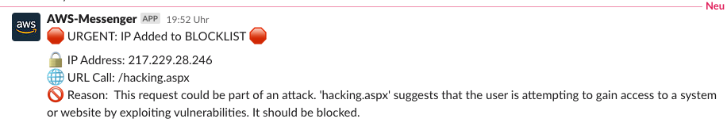

  


# AWS WAFv2 cdk construct for Cloud Development Kit (AWS CDK)


The WAFv2 construct is free for everyone to use and it leverages the massive improvements made by AWS compared to V1.

**Add an extra layer of security to protect your services from common attacks**

It offers a high-level abstraction and integrates neatly with your existing AWS CDK project. It brings AWS best practices into your infrastructure and hides boilerplate logic in your project.

**Features**
* Blocking of requests to your AWS ressources based on IP orign (Country) - If you application is national, restrict the web traffic to the county.

* AWS Managed Rules for AWS WAF is a managed service that provides protection against common application vulnerabilities or other unwanted traffic (https://docs.aws.amazon.com/waf/latest/developerguide/aws-managed-rule-groups-list.html)

* Cloud Watch Dashboards with AWS Logs Insights

**Experimental**
* ChatGPT IP blocking engine. IP Block list is maintained by ChatGPT evaluation.
* Support for Slack notifications

***Notifications***
If ChatGPT functionality is enabled, you can also pass a sns_topic to the construct. This will enable ChatGPT block notifications to Slack. Use our integration example to get going from: https://github.com/ZDF-OSS/aws-slack-notifications after you have deployed the stack, you get the sns topic and pass it to the construct (snsNotificationArn).



The Construct is available in the following languages:

* JavaScript, TypeScript ([Node.js ≥ 14.15.0](https://nodejs.org/download/release/latest-v14.x/))
  * We recommend using a version in [Active LTS](https://nodejs.org/en/about/releases/)

Third-party Language Deprecation: language version is only supported until its EOL (End Of Life) shared by the vendor or community and is subject to change with prior notice.


## Dashbord


***AWS Managed Rules***
AWS Managed Rules for AWS WAF is a managed service that provides protection against common application vulnerabilities or other unwanted traffic. You have the option of selecting one or more rule groups from AWS Managed Rules for each web ACL, up to the maximum web ACL capacity unit (WCU) limit.


\
Jump To:
[Getting Started](#getting-started)
[Getting Help](#getting-help)
[Contributing](#contributing)
[Roadmap](https://github.com/ZDF-OSS/cdk-aws-wafv2-geofence-lib/blob/main/ROADMAP.md)
[More Resources](#more-resources)

-------


#### Logging
Enabled logging sends all information to the CloudWatch LogGroup.

-------
## TL;TR;

Use our construct by installing the module and using our construct in your code:

```sh
npm install -g aws-cdk
npm install aws-cdk-lib
npm install cdk-aws-wafv2-geofence-lib
```
**allowedCountiesToAccessService** expects an array of two-character country codes that you want to match against, for example, [ "US", "CN" ], from the alpha-2 country ISO codes of the ISO 3166 international standard.

When you use a geo match statement just for the region and country labels that it adds to requests, you still have to supply a country code for the rule to evaluate. In this case, you configure the rule to only count matching requests, but it will still generate logging and count metrics for any matches. You can reduce the logging and metrics that the rule produces by specifying a country that's unlikely to be a source of traffic to your site.  (https://docs.aws.amazon.com/waf/latest/APIReference/API_GeoMatchStatement.html)

```ts
  import { CdkWafGeoLib } from 'cdk-aws-wafv2-geofence-lib'
```

```ts
   // AWS WAFv2 GeoBlocking CDK Component
    const allowedCountiesToAccessService = ["DE"]
    new CdkWafGeoLib(this, 'Cdk-Waf-Geo-Lib', {
      // Geo blocking
      allowedCountiesToAccessService: ['DE'],
      enableGeoBlocking: false,

      resourceArn: lb.loadBalancerArn,
      priority: 233,

      // Cloud watch logs need to be enabled, if you want Dashboards and if you want to try the ChatGPT exp feature.
      enableCloudWatchLogs: true,

      // AWS Default WAF Rules
      enableAWSManagedRulesBlocking: true,
      // There are more AWS Managed rules to enable availible...
      enableAWSManagedRuleCRS: true,

      //ChatGPT blocking switch - dont forget to set the API Key in Secrets Manager after provisioning.// Get your API key from https://platform.openai.com/account/api-keys
      enableChatGPTBlocking: true,
      //Deploys the ChatGPT looging infrastructure. Dont toggle it of, if you want to keep your data.
      deployChatGPTBlocking: true,

      //If using ChatGPT - you can also enable notifications too. Feel free to use our cdk example on how to implement Slack Notifications. https://github.com/ZDF-OSS/aws-slack-notifications
      snsNotificationArn: 'arn:aws:sns:eu-central-1:326941568664:notifications-to-channel',
    });
```

#### Properties <a name="Properties" id="Properties"></a>

| **Name**                                                                                                                                                   | **Type**                                        | **Description**                                                                                                                                                                                                                        |
| ---------------------------------------------------------------------------------------------------------------------------------------------------------- | ----------------------------------------------- | -------------------------------------------------------------------------------------------------------------------------------------------------------------------------------------------------------------------------------------- |
| <code><a href="#cdk-aws-wafv2-geofence-lib.ICdkWafGeoLibProps.property.allowedCountiesToAccessService">allowedCountiesToAccessService</a></code>           | <code>string[]</code>                           | Allowed countries to access the backend - for example DE, EN, DK.                                                                                                                                                                      |
| <code><a href="#cdk-aws-wafv2-geofence-lib.ICdkWafGeoLibProps.property.deployChatGPTBlocking">deployChatGPTBlocking</a></code>                             | <code>boolean</code>                            | Switch to control if the rule should let ChatGPT block or count incomming requests.                                                                                                                                                    |
| <code><a href="#cdk-aws-wafv2-geofence-lib.ICdkWafGeoLibProps.property.enableAWSManagedRulesBlocking">enableAWSManagedRulesBlocking</a></code>             | <code>boolean</code>                            | Switch to control if the rule should block or count incomming requests hitting the AWS Manged Rules.                                                                                                                                   |
| <code><a href="#cdk-aws-wafv2-geofence-lib.ICdkWafGeoLibProps.property.enableChatGPTBlocking">enableChatGPTBlocking</a></code>                             | <code>boolean</code>                            | Deploy ChatGPT blocking infrastructure e.g. DynamoDB, Lambdas, CW Rules.                                                                                                                                                               |
| <code><a href="#cdk-aws-wafv2-geofence-lib.ICdkWafGeoLibProps.property.enableGeoBlocking">enableGeoBlocking</a></code>                                     | <code>boolean</code>                            | Switch to control if the rule should block or count incomming requests.                                                                                                                                                                |
| <code><a href="#cdk-aws-wafv2-geofence-lib.ICdkWafGeoLibProps.property.priority">priority</a></code>                                                       | <code>number</code>                             | Priority of the WAFv2 rule.                                                                                                                                                                                                            |
| <code><a href="#cdk-aws-wafv2-geofence-lib.ICdkWafGeoLibProps.property.resourceArn">resourceArn</a></code>                                                 | <code>string</code>                             | Arn of the ressource to protect.                                                                                                                                                                                                       |
| <code><a href="#cdk-aws-wafv2-geofence-lib.ICdkWafGeoLibProps.property.block">block</a></code>                                                             | <code>boolean</code>                            | Deprecated: -  use enableGeoBlocking Switch to control if the rule should block or count incomming requests.                                                                                                                           |
| <code><a href="#cdk-aws-wafv2-geofence-lib.ICdkWafGeoLibProps.property.cloudWatchLogGroupName">cloudWatchLogGroupName</a></code>                           | <code>string</code>                             | Name of the CloudWatch LogGroup where requests are stored.                                                                                                                                                                             |
| <code><a href="#cdk-aws-wafv2-geofence-lib.ICdkWafGeoLibProps.property.enableAWSManagedRuleCRS">enableAWSManagedRuleCRS</a></code>                         | <code>boolean</code>                            | The Core rule set (CRS) rule group contains rules that are generally applicable to web applications.                                                                                                                                   |
| <code><a href="#cdk-aws-wafv2-geofence-lib.ICdkWafGeoLibProps.property.enableAWSMangedRuleAdminProtect">enableAWSMangedRuleAdminProtect</a></code>         | <code>boolean</code>                            | The Admin protection rule group contains rules that allow you to block external access to exposed administrative pages.                                                                                                                |
| <code><a href="#cdk-aws-wafv2-geofence-lib.ICdkWafGeoLibProps.property.enableAWSMangedRuleAnonIP">enableAWSMangedRuleAnonIP</a></code>                     | <code>boolean</code>                            | The Anonymous IP list rule group contains rules to block requests from services that permit the obfuscation of viewer identity.                                                                                                        |
| <code><a href="#cdk-aws-wafv2-geofence-lib.ICdkWafGeoLibProps.property.enableAWSMangedRuleIPRep">enableAWSMangedRuleIPRep</a></code>                       | <code>boolean</code>                            | The Amazon IP reputation list rule group contains rules that are based on Amazon internal threat intelligence.                                                                                                                         |
| <code><a href="#cdk-aws-wafv2-geofence-lib.ICdkWafGeoLibProps.property.enableAWSMangedRuleKBI">enableAWSMangedRuleKBI</a></code>                           | <code>boolean</code>                            | The Known bad inputs rule group contains rules to block request patterns that are known to be invalid and are associated with exploitation or discovery of vulnerabilities.                                                            |
| <code><a href="#cdk-aws-wafv2-geofence-lib.ICdkWafGeoLibProps.property.enableAWSMangedRuleLinuxProtect">enableAWSMangedRuleLinuxProtect</a></code>         | <code>boolean</code>                            | The Linux operating system rule group contains rules that block request patterns associated with the exploitation of vulnerabilities specific to Linux, including Linux-specific Local File Inclusion (LFI) attacks.                   |
| <code><a href="#cdk-aws-wafv2-geofence-lib.ICdkWafGeoLibProps.property.enableAWSMangedRulePHPProtect">enableAWSMangedRulePHPProtect</a></code>             | <code>boolean</code>                            | The PHP application rule group contains rules that block request patterns associated with the exploitation of vulnerabilities specific to the use of the PHP programming language, including injection of unsafe PHP functions.        |
| <code><a href="#cdk-aws-wafv2-geofence-lib.ICdkWafGeoLibProps.property.enableAWSMangedRuleSQLi">enableAWSMangedRuleSQLi</a></code>                         | <code>boolean</code>                            | The SQL database rule group contains rules to block request patterns associated with exploitation of SQL databases, like SQL injection attacks.                                                                                        |
| <code><a href="#cdk-aws-wafv2-geofence-lib.ICdkWafGeoLibProps.property.enableAWSMangedRuleUnixProtect">enableAWSMangedRuleUnixProtect</a></code>           | <code>boolean</code>                            | The POSIX operating system rule group contains rules that block request patterns associated with the exploitation of vulnerabilities specific to POSIX and POSIX-like operating systems, including Local File Inclusion (LFI) attacks. |
| <code><a href="#cdk-aws-wafv2-geofence-lib.ICdkWafGeoLibProps.property.enableAWSMangedRuleWindowsProtect">enableAWSMangedRuleWindowsProtect</a></code>     | <code>boolean</code>                            | The Windows operating system rule group contains rules that block request patterns associated with the exploitation of vulnerabilities specific to Windows, like remote execution of PowerShell commands.                              |
| <code><a href="#cdk-aws-wafv2-geofence-lib.ICdkWafGeoLibProps.property.enableAWSMangedRuleWorkpressProtect">enableAWSMangedRuleWorkpressProtect</a></code> | <code>boolean</code>                            | The WordPress application rule group contains rules that block request patterns associated with the exploitation of vulnerabilities specific to WordPress sites.                                                                       |
| <code><a href="#cdk-aws-wafv2-geofence-lib.ICdkWafGeoLibProps.property.enableCloudWatchLogs">enableCloudWatchLogs</a></code>                               | <code>boolean</code>                            | Sends logs to a CloudWatch LogGroup with a retention on it.                                                                                                                                                                            |
| <code><a href="#cdk-aws-wafv2-geofence-lib.ICdkWafGeoLibProps.property.retentionDays">retentionDays</a></code>                                             | <code>aws-cdk-lib.aws_logs.RetentionDays</code> | Retention period to keep logs.                                                                                                                                                                                                         |
---
## Getting Started

Install or update the [AWS CDK CLI] from npm (requires [Node.js ≥ 14.15.0](https://nodejs.org/download/release/latest-v14.x/)). We recommend using a version in [Active LTS](https://nodejs.org/en/about/releases/) and then install the component

```sh
npm install -g aws-cdk
npm install aws-cdk-lib
```

Initialize a project with our component:

```sh
mkdir hello-cdk
cd hello-cdk
cdk init sample-app --language=typescript
npm install cdk-aws-wafv2-geofence-lib
```

This creates a sample project - replace the sample code with:

```ts
import * as path from 'path';
import * as cdk from 'aws-cdk-lib';
import { Platform } from 'aws-cdk-lib/aws-ecr-assets';
import { Construct } from 'constructs';
import { CdkWafGeoLib } from './index';

export class EcsBpMicroserviceWaf extends cdk.Stack {
  constructor(scope: Construct, id: string, props?: cdk.StackProps) {
    super(scope, id, props);
    const product = 'integ';


    const vpc = new cdk.aws_ec2.Vpc(this, 'integ-vpc', {
      ipAddresses: cdk.aws_ec2.IpAddresses.cidr('10.0.0.0/16'),
      maxAzs: 2,
    });

    const cluster = new cdk.aws_ecs.Cluster(this, 'integ-ecs-cluster', {
      clusterName: 'integ-ecs-cluster',
      vpc: vpc,
    });

    const task = new cdk.aws_ecs.FargateTaskDefinition(this, 'integ-td', {
      memoryLimitMiB: 512,
      cpu: 256,
      runtimePlatform: {
        operatingSystemFamily: cdk.aws_ecs.OperatingSystemFamily.LINUX,
        cpuArchitecture: cdk.aws_ecs.CpuArchitecture.ARM64,
      },
    });

    const imageAsset = new cdk.aws_ecr_assets.DockerImageAsset(
      this,
      'integ-image',
      {
        directory: path.join(__dirname, '../src/backend'),
        platform: Platform.LINUX_ARM64,
      },
    );

    const image = cdk.aws_ecs.ContainerImage.fromDockerImageAsset(imageAsset);
    task.addContainer('integ-container', {
      containerName: `${product}`,
      image,
      portMappings: [{ containerPort: 80 }],
      logging: cdk.aws_ecs.LogDriver.awsLogs({
        streamPrefix: `${product}`,
      }),
    });

    const sg = new cdk.aws_ec2.SecurityGroup(this, 'integ-sg', {
      vpc,
      allowAllOutbound: true,
    });
    sg.addIngressRule(
      cdk.aws_ec2.Peer.anyIpv4(),
      cdk.aws_ec2.Port.tcp(808),
      'Allowing traffic to the backend',
    );

    const service = new cdk.aws_ecs.FargateService(this, 'integ-service', {
      cluster,
      serviceName: `${product}-service`,
      taskDefinition: task,
      securityGroups: [sg],
      desiredCount: 1,
      assignPublicIp: false,
    });

    const lb = new cdk.aws_elasticloadbalancingv2.ApplicationLoadBalancer(
      this,
      'integ-lb',
      {
        vpc,
        internetFacing: true,
        loadBalancerName: 'integ-lb',
      },
    );

    const listener = lb.addListener('integ-listener', {
      port: 808,
      protocol: cdk.aws_elasticloadbalancingv2.ApplicationProtocol.HTTP,
    });

    const tg = listener.addTargets('integ-targets', {
      port: 80,
      protocol: cdk.aws_elasticloadbalancingv2.ApplicationProtocol.HTTP,
      targets: [service],
      deregistrationDelay: cdk.Duration.seconds(1),
      targetGroupName: `${product}-targets`,
    });

    const scaling = service.autoScaleTaskCount({ maxCapacity: 10 });
    scaling.scaleOnRequestCount('RequestScaling', {
      requestsPerTarget: 500,
      targetGroup: tg,
    });

    new CdkWafGeoLib(this, 'Cdk-Waf-Geo-Lib', {
      // Geo blocking
      allowedCountiesToAccessService: ['DE'],
      enableGeoBlocking: false,
      resourceArn: lb.loadBalancerArn,
      priority: 100,
      enableCloudWatchLogs: true,
      // AWS Default WAF Rules
      enableAWSManagedRulesBlocking: true,
      enableAWSManagedRuleCRS: true,
      //ChatGPT
      enableChatGPTBlocking: true,
      deployChatGPTBlocking: true,
      //If using ChatGPT - you can also enable notifications too. Feel free to use our cdk example on how to implement Slack Notifications. https://github.com/ZDF-OSS/aws-slack-notifications
      snsNotificationArn: 'arn:aws:sns:eu-central-1:326941568664:notifications-to-channel',
    });
  }
}

```

## Integration Testing

The integrations test deploys the solution with a microservice and a loadbalancer. The microservice runs inside an ecs cluster.

Deploy the solution for testing
```ts
cdk --app='./lib/integ.default.js' deploy
```

Destroy the solution
```ts
cdk --app='./lib/integ.default.js' destroy
```


## Getting Help

The best way to interact with our team is through GitHub or mail. You can open an [issue](https://github.com/ZDF-OSS/cdk-aws-wafv2-geofence-lib/issues/new/choose) and choose from one of our templates for bug reports, feature requests, documentation issues.

## Roadmap
The project board lets developers know about our upcoming features and priorities to help them plan how to best leverage our construct
[Roadmap](https://github.com/ZDF-OSS/cdk-aws-wafv2-geofence-lib/blob/main/ROADMAP.md)

## Contributing

We welcome community contributions and pull requests.

## More Resources
* [License](./LICENSE)
# API Reference <a name="API Reference" id="api-reference"></a>

## Constructs <a name="Constructs" id="Constructs"></a>

### CdkWafGeoLib <a name="CdkWafGeoLib" id="cdk-aws-wafv2-geofence-lib.CdkWafGeoLib"></a>

#### Initializers <a name="Initializers" id="cdk-aws-wafv2-geofence-lib.CdkWafGeoLib.Initializer"></a>

```typescript
import { CdkWafGeoLib } from 'cdk-aws-wafv2-geofence-lib'

new CdkWafGeoLib(scope: Construct, id: string, props: ICdkWafGeoLibProps)
```

| **Name** | **Type** | **Description** |
| --- | --- | --- |
| <code><a href="#cdk-aws-wafv2-geofence-lib.CdkWafGeoLib.Initializer.parameter.scope">scope</a></code> | <code>constructs.Construct</code> | *No description.* |
| <code><a href="#cdk-aws-wafv2-geofence-lib.CdkWafGeoLib.Initializer.parameter.id">id</a></code> | <code>string</code> | *No description.* |
| <code><a href="#cdk-aws-wafv2-geofence-lib.CdkWafGeoLib.Initializer.parameter.props">props</a></code> | <code><a href="#cdk-aws-wafv2-geofence-lib.ICdkWafGeoLibProps">ICdkWafGeoLibProps</a></code> | *No description.* |

---

##### `scope`<sup>Required</sup> <a name="scope" id="cdk-aws-wafv2-geofence-lib.CdkWafGeoLib.Initializer.parameter.scope"></a>

- *Type:* constructs.Construct

---

##### `id`<sup>Required</sup> <a name="id" id="cdk-aws-wafv2-geofence-lib.CdkWafGeoLib.Initializer.parameter.id"></a>

- *Type:* string

---

##### `props`<sup>Required</sup> <a name="props" id="cdk-aws-wafv2-geofence-lib.CdkWafGeoLib.Initializer.parameter.props"></a>

- *Type:* <a href="#cdk-aws-wafv2-geofence-lib.ICdkWafGeoLibProps">ICdkWafGeoLibProps</a>

---

#### Methods <a name="Methods" id="Methods"></a>

| **Name** | **Description** |
| --- | --- |
| <code><a href="#cdk-aws-wafv2-geofence-lib.CdkWafGeoLib.toString">toString</a></code> | Returns a string representation of this construct. |

---

##### `toString` <a name="toString" id="cdk-aws-wafv2-geofence-lib.CdkWafGeoLib.toString"></a>

```typescript
public toString(): string
```

Returns a string representation of this construct.

#### Static Functions <a name="Static Functions" id="Static Functions"></a>

| **Name** | **Description** |
| --- | --- |
| <code><a href="#cdk-aws-wafv2-geofence-lib.CdkWafGeoLib.isConstruct">isConstruct</a></code> | Checks if `x` is a construct. |

---

##### ~~`isConstruct`~~ <a name="isConstruct" id="cdk-aws-wafv2-geofence-lib.CdkWafGeoLib.isConstruct"></a>

```typescript
import { CdkWafGeoLib } from 'cdk-aws-wafv2-geofence-lib'

CdkWafGeoLib.isConstruct(x: any)
```

Checks if `x` is a construct.

###### `x`<sup>Required</sup> <a name="x" id="cdk-aws-wafv2-geofence-lib.CdkWafGeoLib.isConstruct.parameter.x"></a>

- *Type:* any

Any object.

---

#### Properties <a name="Properties" id="Properties"></a>

| **Name** | **Type** | **Description** |
| --- | --- | --- |
| <code><a href="#cdk-aws-wafv2-geofence-lib.CdkWafGeoLib.property.node">node</a></code> | <code>constructs.Node</code> | The tree node. |
| <code><a href="#cdk-aws-wafv2-geofence-lib.CdkWafGeoLib.property.customResourceResult">customResourceResult</a></code> | <code>string</code> | *No description.* |

---

##### `node`<sup>Required</sup> <a name="node" id="cdk-aws-wafv2-geofence-lib.CdkWafGeoLib.property.node"></a>

```typescript
public readonly node: Node;
```

- *Type:* constructs.Node

The tree node.

---

##### `customResourceResult`<sup>Optional</sup> <a name="customResourceResult" id="cdk-aws-wafv2-geofence-lib.CdkWafGeoLib.property.customResourceResult"></a>

```typescript
public readonly customResourceResult: string;
```

- *Type:* string

---


## Protocols <a name="Protocols" id="Protocols"></a>

### ICdkWafGeoLibProps <a name="ICdkWafGeoLibProps" id="cdk-aws-wafv2-geofence-lib.ICdkWafGeoLibProps"></a>

- *Implemented By:* <a href="#cdk-aws-wafv2-geofence-lib.ICdkWafGeoLibProps">ICdkWafGeoLibProps</a>


#### Properties <a name="Properties" id="Properties"></a>

| **Name** | **Type** | **Description** |
| --- | --- | --- |
| <code><a href="#cdk-aws-wafv2-geofence-lib.ICdkWafGeoLibProps.property.allowedCountiesToAccessService">allowedCountiesToAccessService</a></code> | <code>string[]</code> | Allowed countries to access the backend - for example DE, EN, DK. |
| <code><a href="#cdk-aws-wafv2-geofence-lib.ICdkWafGeoLibProps.property.deployChatGPTBlocking">deployChatGPTBlocking</a></code> | <code>boolean</code> | Switch to control if the rule should let ChatGPT block or count incomming requests. |
| <code><a href="#cdk-aws-wafv2-geofence-lib.ICdkWafGeoLibProps.property.enableAWSManagedRulesBlocking">enableAWSManagedRulesBlocking</a></code> | <code>boolean</code> | Switch to control if the rule should block or count incomming requests hitting the AWS Manged Rules. |
| <code><a href="#cdk-aws-wafv2-geofence-lib.ICdkWafGeoLibProps.property.enableChatGPTBlocking">enableChatGPTBlocking</a></code> | <code>boolean</code> | Deploy ChatGPT blocking infrastructure e.g. DynamoDB, Lambdas, CW Rules. |
| <code><a href="#cdk-aws-wafv2-geofence-lib.ICdkWafGeoLibProps.property.enableGeoBlocking">enableGeoBlocking</a></code> | <code>boolean</code> | Switch to control if the rule should block or count incomming requests. |
| <code><a href="#cdk-aws-wafv2-geofence-lib.ICdkWafGeoLibProps.property.priority">priority</a></code> | <code>number</code> | Priority of the WAFv2 rule. |
| <code><a href="#cdk-aws-wafv2-geofence-lib.ICdkWafGeoLibProps.property.resourceArn">resourceArn</a></code> | <code>string</code> | Arn of the ressource to protect. |
| <code><a href="#cdk-aws-wafv2-geofence-lib.ICdkWafGeoLibProps.property.block">block</a></code> | <code>boolean</code> | Deprecated: -  use enableGeoBlocking Switch to control if the rule should block or count incomming requests. |
| <code><a href="#cdk-aws-wafv2-geofence-lib.ICdkWafGeoLibProps.property.cloudWatchLogGroupName">cloudWatchLogGroupName</a></code> | <code>string</code> | Name of the CloudWatch LogGroup where requests are stored. |
| <code><a href="#cdk-aws-wafv2-geofence-lib.ICdkWafGeoLibProps.property.enableAWSManagedRuleCRS">enableAWSManagedRuleCRS</a></code> | <code>boolean</code> | The Core rule set (CRS) rule group contains rules that are generally applicable to web applications. |
| <code><a href="#cdk-aws-wafv2-geofence-lib.ICdkWafGeoLibProps.property.enableAWSMangedRuleAdminProtect">enableAWSMangedRuleAdminProtect</a></code> | <code>boolean</code> | The Admin protection rule group contains rules that allow you to block external access to exposed administrative pages. |
| <code><a href="#cdk-aws-wafv2-geofence-lib.ICdkWafGeoLibProps.property.enableAWSMangedRuleAnonIP">enableAWSMangedRuleAnonIP</a></code> | <code>boolean</code> | The Anonymous IP list rule group contains rules to block requests from services that permit the obfuscation of viewer identity. |
| <code><a href="#cdk-aws-wafv2-geofence-lib.ICdkWafGeoLibProps.property.enableAWSMangedRuleIPRep">enableAWSMangedRuleIPRep</a></code> | <code>boolean</code> | The Amazon IP reputation list rule group contains rules that are based on Amazon internal threat intelligence. |
| <code><a href="#cdk-aws-wafv2-geofence-lib.ICdkWafGeoLibProps.property.enableAWSMangedRuleKBI">enableAWSMangedRuleKBI</a></code> | <code>boolean</code> | The Known bad inputs rule group contains rules to block request patterns that are known to be invalid and are associated with exploitation or discovery of vulnerabilities. |
| <code><a href="#cdk-aws-wafv2-geofence-lib.ICdkWafGeoLibProps.property.enableAWSMangedRuleLinuxProtect">enableAWSMangedRuleLinuxProtect</a></code> | <code>boolean</code> | The Linux operating system rule group contains rules that block request patterns associated with the exploitation of vulnerabilities specific to Linux, including Linux-specific Local File Inclusion (LFI) attacks. |
| <code><a href="#cdk-aws-wafv2-geofence-lib.ICdkWafGeoLibProps.property.enableAWSMangedRulePHPProtect">enableAWSMangedRulePHPProtect</a></code> | <code>boolean</code> | The PHP application rule group contains rules that block request patterns associated with the exploitation of vulnerabilities specific to the use of the PHP programming language, including injection of unsafe PHP functions. |
| <code><a href="#cdk-aws-wafv2-geofence-lib.ICdkWafGeoLibProps.property.enableAWSMangedRuleSQLi">enableAWSMangedRuleSQLi</a></code> | <code>boolean</code> | The SQL database rule group contains rules to block request patterns associated with exploitation of SQL databases, like SQL injection attacks. |
| <code><a href="#cdk-aws-wafv2-geofence-lib.ICdkWafGeoLibProps.property.enableAWSMangedRuleUnixProtect">enableAWSMangedRuleUnixProtect</a></code> | <code>boolean</code> | The POSIX operating system rule group contains rules that block request patterns associated with the exploitation of vulnerabilities specific to POSIX and POSIX-like operating systems, including Local File Inclusion (LFI) attacks. |
| <code><a href="#cdk-aws-wafv2-geofence-lib.ICdkWafGeoLibProps.property.enableAWSMangedRuleWindowsProtect">enableAWSMangedRuleWindowsProtect</a></code> | <code>boolean</code> | The Windows operating system rule group contains rules that block request patterns associated with the exploitation of vulnerabilities specific to Windows, like remote execution of PowerShell commands. |
| <code><a href="#cdk-aws-wafv2-geofence-lib.ICdkWafGeoLibProps.property.enableAWSMangedRuleWorkpressProtect">enableAWSMangedRuleWorkpressProtect</a></code> | <code>boolean</code> | The WordPress application rule group contains rules that block request patterns associated with the exploitation of vulnerabilities specific to WordPress sites. |
| <code><a href="#cdk-aws-wafv2-geofence-lib.ICdkWafGeoLibProps.property.enableCloudWatchLogs">enableCloudWatchLogs</a></code> | <code>boolean</code> | Sends logs to a CloudWatch LogGroup with a retention on it. |
| <code><a href="#cdk-aws-wafv2-geofence-lib.ICdkWafGeoLibProps.property.retentionDays">retentionDays</a></code> | <code>aws-cdk-lib.aws_logs.RetentionDays</code> | Retention period to keep logs. |
| <code><a href="#cdk-aws-wafv2-geofence-lib.ICdkWafGeoLibProps.property.snsNotificationArn">snsNotificationArn</a></code> | <code>string</code> | SNS Topic Arn of for sending notifications about ChatGPT Blocking results. |

---

##### `allowedCountiesToAccessService`<sup>Required</sup> <a name="allowedCountiesToAccessService" id="cdk-aws-wafv2-geofence-lib.ICdkWafGeoLibProps.property.allowedCountiesToAccessService"></a>

```typescript
public readonly allowedCountiesToAccessService: string[];
```

- *Type:* string[]

Allowed countries to access the backend - for example DE, EN, DK.

---

##### `deployChatGPTBlocking`<sup>Required</sup> <a name="deployChatGPTBlocking" id="cdk-aws-wafv2-geofence-lib.ICdkWafGeoLibProps.property.deployChatGPTBlocking"></a>

```typescript
public readonly deployChatGPTBlocking: boolean;
```

- *Type:* boolean

Switch to control if the rule should let ChatGPT block or count incomming requests.

---

##### `enableAWSManagedRulesBlocking`<sup>Required</sup> <a name="enableAWSManagedRulesBlocking" id="cdk-aws-wafv2-geofence-lib.ICdkWafGeoLibProps.property.enableAWSManagedRulesBlocking"></a>

```typescript
public readonly enableAWSManagedRulesBlocking: boolean;
```

- *Type:* boolean

Switch to control if the rule should block or count incomming requests hitting the AWS Manged Rules.

---

##### `enableChatGPTBlocking`<sup>Required</sup> <a name="enableChatGPTBlocking" id="cdk-aws-wafv2-geofence-lib.ICdkWafGeoLibProps.property.enableChatGPTBlocking"></a>

```typescript
public readonly enableChatGPTBlocking: boolean;
```

- *Type:* boolean

Deploy ChatGPT blocking infrastructure e.g. DynamoDB, Lambdas, CW Rules.

---

##### `enableGeoBlocking`<sup>Required</sup> <a name="enableGeoBlocking" id="cdk-aws-wafv2-geofence-lib.ICdkWafGeoLibProps.property.enableGeoBlocking"></a>

```typescript
public readonly enableGeoBlocking: boolean;
```

- *Type:* boolean

Switch to control if the rule should block or count incomming requests.

---

##### `priority`<sup>Required</sup> <a name="priority" id="cdk-aws-wafv2-geofence-lib.ICdkWafGeoLibProps.property.priority"></a>

```typescript
public readonly priority: number;
```

- *Type:* number

Priority of the WAFv2 rule.

---

##### `resourceArn`<sup>Required</sup> <a name="resourceArn" id="cdk-aws-wafv2-geofence-lib.ICdkWafGeoLibProps.property.resourceArn"></a>

```typescript
public readonly resourceArn: string;
```

- *Type:* string

Arn of the ressource to protect.

---

##### `block`<sup>Optional</sup> <a name="block" id="cdk-aws-wafv2-geofence-lib.ICdkWafGeoLibProps.property.block"></a>

```typescript
public readonly block: boolean;
```

- *Type:* boolean

Deprecated: -  use enableGeoBlocking Switch to control if the rule should block or count incomming requests.

---

##### `cloudWatchLogGroupName`<sup>Optional</sup> <a name="cloudWatchLogGroupName" id="cdk-aws-wafv2-geofence-lib.ICdkWafGeoLibProps.property.cloudWatchLogGroupName"></a>

```typescript
public readonly cloudWatchLogGroupName: string;
```

- *Type:* string

Name of the CloudWatch LogGroup where requests are stored.

---

##### `enableAWSManagedRuleCRS`<sup>Optional</sup> <a name="enableAWSManagedRuleCRS" id="cdk-aws-wafv2-geofence-lib.ICdkWafGeoLibProps.property.enableAWSManagedRuleCRS"></a>

```typescript
public readonly enableAWSManagedRuleCRS: boolean;
```

- *Type:* boolean

The Core rule set (CRS) rule group contains rules that are generally applicable to web applications.

This provides protection against exploitation of a wide range of vulnerabilities, including some of the high risk and commonly occurring vulnerabilities described in OWASP publications such as OWASP Top 10. Consider using this rule group for any AWS WAF use case.

---

##### `enableAWSMangedRuleAdminProtect`<sup>Optional</sup> <a name="enableAWSMangedRuleAdminProtect" id="cdk-aws-wafv2-geofence-lib.ICdkWafGeoLibProps.property.enableAWSMangedRuleAdminProtect"></a>

```typescript
public readonly enableAWSMangedRuleAdminProtect: boolean;
```

- *Type:* boolean

The Admin protection rule group contains rules that allow you to block external access to exposed administrative pages.

This might be useful if you run third-party software or want to reduce the risk of a malicious actor gaining administrative access to your application.

---

##### `enableAWSMangedRuleAnonIP`<sup>Optional</sup> <a name="enableAWSMangedRuleAnonIP" id="cdk-aws-wafv2-geofence-lib.ICdkWafGeoLibProps.property.enableAWSMangedRuleAnonIP"></a>

```typescript
public readonly enableAWSMangedRuleAnonIP: boolean;
```

- *Type:* boolean

The Anonymous IP list rule group contains rules to block requests from services that permit the obfuscation of viewer identity.

These include requests from VPNs, proxies, Tor nodes, and hosting providers. This rule group is useful if you want to filter out viewers that might be trying to hide their identity from your application. Blocking the IP addresses of these services can help mitigate bots and evasion of geographic restrictions.

---

##### `enableAWSMangedRuleIPRep`<sup>Optional</sup> <a name="enableAWSMangedRuleIPRep" id="cdk-aws-wafv2-geofence-lib.ICdkWafGeoLibProps.property.enableAWSMangedRuleIPRep"></a>

```typescript
public readonly enableAWSMangedRuleIPRep: boolean;
```

- *Type:* boolean

The Amazon IP reputation list rule group contains rules that are based on Amazon internal threat intelligence.

This is useful if you would like to block IP addresses typically associated with bots or other threats. Blocking these IP addresses can help mitigate bots and reduce the risk of a malicious actor discovering a vulnerable application.

---

##### `enableAWSMangedRuleKBI`<sup>Optional</sup> <a name="enableAWSMangedRuleKBI" id="cdk-aws-wafv2-geofence-lib.ICdkWafGeoLibProps.property.enableAWSMangedRuleKBI"></a>

```typescript
public readonly enableAWSMangedRuleKBI: boolean;
```

- *Type:* boolean

The Known bad inputs rule group contains rules to block request patterns that are known to be invalid and are associated with exploitation or discovery of vulnerabilities.

This can help reduce the risk of a malicious actor discovering a vulnerable application.

---

##### `enableAWSMangedRuleLinuxProtect`<sup>Optional</sup> <a name="enableAWSMangedRuleLinuxProtect" id="cdk-aws-wafv2-geofence-lib.ICdkWafGeoLibProps.property.enableAWSMangedRuleLinuxProtect"></a>

```typescript
public readonly enableAWSMangedRuleLinuxProtect: boolean;
```

- *Type:* boolean

The Linux operating system rule group contains rules that block request patterns associated with the exploitation of vulnerabilities specific to Linux, including Linux-specific Local File Inclusion (LFI) attacks.

This can help prevent attacks that expose file contents or run code for which the attacker should not have had access. You should evaluate this rule group if any part of your application runs on Linux. You should use this rule group in conjunction with the POSIX operating system rule group.

---

##### `enableAWSMangedRulePHPProtect`<sup>Optional</sup> <a name="enableAWSMangedRulePHPProtect" id="cdk-aws-wafv2-geofence-lib.ICdkWafGeoLibProps.property.enableAWSMangedRulePHPProtect"></a>

```typescript
public readonly enableAWSMangedRulePHPProtect: boolean;
```

- *Type:* boolean

The PHP application rule group contains rules that block request patterns associated with the exploitation of vulnerabilities specific to the use of the PHP programming language, including injection of unsafe PHP functions.

This can help prevent exploitation of vulnerabilities that permit an attacker to remotely run code or commands for which they are not authorized. Evaluate this rule group if PHP is installed on any server with which your application interfaces.

---

##### `enableAWSMangedRuleSQLi`<sup>Optional</sup> <a name="enableAWSMangedRuleSQLi" id="cdk-aws-wafv2-geofence-lib.ICdkWafGeoLibProps.property.enableAWSMangedRuleSQLi"></a>

```typescript
public readonly enableAWSMangedRuleSQLi: boolean;
```

- *Type:* boolean

The SQL database rule group contains rules to block request patterns associated with exploitation of SQL databases, like SQL injection attacks.

This can help prevent remote injection of unauthorized queries. Evaluate this rule group for use if your application interfaces with an SQL database.

---

##### `enableAWSMangedRuleUnixProtect`<sup>Optional</sup> <a name="enableAWSMangedRuleUnixProtect" id="cdk-aws-wafv2-geofence-lib.ICdkWafGeoLibProps.property.enableAWSMangedRuleUnixProtect"></a>

```typescript
public readonly enableAWSMangedRuleUnixProtect: boolean;
```

- *Type:* boolean

The POSIX operating system rule group contains rules that block request patterns associated with the exploitation of vulnerabilities specific to POSIX and POSIX-like operating systems, including Local File Inclusion (LFI) attacks.

This can help prevent attacks that expose file contents or run code for which the attacker should not have had access. You should evaluate this rule group if any part of your application runs on a POSIX or POSIX-like operating system, including Linux, AIX, HP-UX, macOS, Solaris, FreeBSD, and OpenBSD.

---

##### `enableAWSMangedRuleWindowsProtect`<sup>Optional</sup> <a name="enableAWSMangedRuleWindowsProtect" id="cdk-aws-wafv2-geofence-lib.ICdkWafGeoLibProps.property.enableAWSMangedRuleWindowsProtect"></a>

```typescript
public readonly enableAWSMangedRuleWindowsProtect: boolean;
```

- *Type:* boolean

The Windows operating system rule group contains rules that block request patterns associated with the exploitation of vulnerabilities specific to Windows, like remote execution of PowerShell commands.

This can help prevent exploitation of vulnerabilities that permit an attacker to run unauthorized commands or run malicious code. Evaluate this rule group if any part of your application runs on a Windows operating system.

---

##### `enableAWSMangedRuleWorkpressProtect`<sup>Optional</sup> <a name="enableAWSMangedRuleWorkpressProtect" id="cdk-aws-wafv2-geofence-lib.ICdkWafGeoLibProps.property.enableAWSMangedRuleWorkpressProtect"></a>

```typescript
public readonly enableAWSMangedRuleWorkpressProtect: boolean;
```

- *Type:* boolean

The WordPress application rule group contains rules that block request patterns associated with the exploitation of vulnerabilities specific to WordPress sites.

You should evaluate this rule group if you are running WordPress. This rule group should be used in conjunction with the SQL database and PHP application rule groups.

---

##### `enableCloudWatchLogs`<sup>Optional</sup> <a name="enableCloudWatchLogs" id="cdk-aws-wafv2-geofence-lib.ICdkWafGeoLibProps.property.enableCloudWatchLogs"></a>

```typescript
public readonly enableCloudWatchLogs: boolean;
```

- *Type:* boolean

Sends logs to a CloudWatch LogGroup with a retention on it.

If enabled you also get a CloudWatch Dashboard.

---

##### `retentionDays`<sup>Optional</sup> <a name="retentionDays" id="cdk-aws-wafv2-geofence-lib.ICdkWafGeoLibProps.property.retentionDays"></a>

```typescript
public readonly retentionDays: RetentionDays;
```

- *Type:* aws-cdk-lib.aws_logs.RetentionDays

Retention period to keep logs.

ONE_MONTH is default.

---

##### `snsNotificationArn`<sup>Optional</sup> <a name="snsNotificationArn" id="cdk-aws-wafv2-geofence-lib.ICdkWafGeoLibProps.property.snsNotificationArn"></a>

```typescript
public readonly snsNotificationArn: string;
```

- *Type:* string

SNS Topic Arn of for sending notifications about ChatGPT Blocking results.

---

